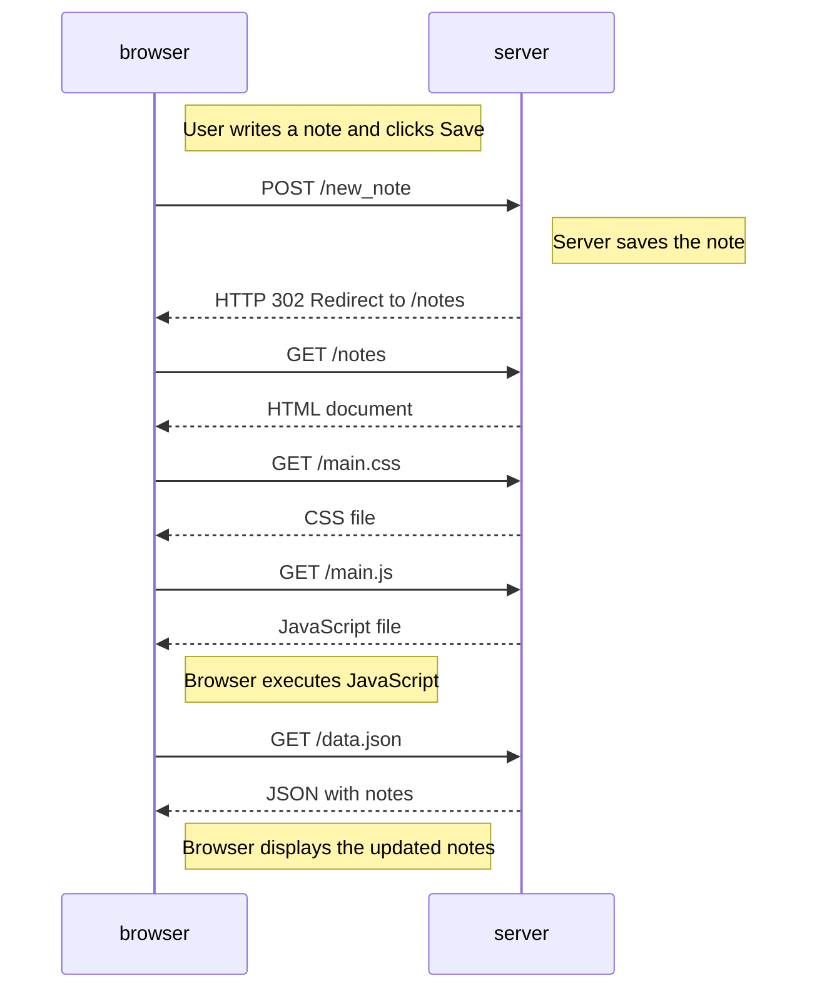

# Exercise 0.4: New note diagram

The diagram shows what happens when a user creates a new note in the traditional notes application.

```mermaid
sequenceDiagram
    participant browser
    participant server

    Note right of browser: User writes a note and clicks Save
    browser->>server: POST /new_note
    Note right of server: Server saves the note
    server-->>browser: HTTP 302 Redirect to /notes

    browser->>server: GET /notes
    server-->>browser: HTML document

    browser->>server: GET /main.css
    server-->>browser: CSS file

    browser->>server: GET /main.js
    server-->>browser: JavaScript file

    Note right of browser: Browser executes JavaScript
    browser->>server: GET /data.json
    server-->>browser: JSON with notes

    Note right of browser: Browser displays the updated notes
```
