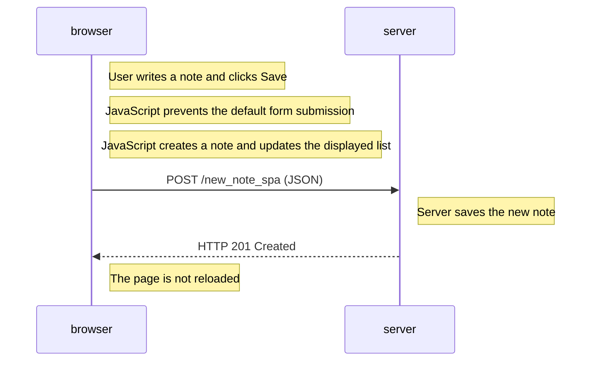

# Exercise 0.6: New note in Single page app diagram

The diagram shows what happens when a user creates a new note in the SPA version of the application.

```mermaid
sequenceDiagram
    participant browser
    participant server

    Note right of browser: User writes a note and clicks Save
    Note right of browser: JavaScript prevents the default form submission
    Note right of browser: JavaScript creates a note and updates the displayed list

    browser->>server: POST /new_note_spa (JSON)
    Note right of server: Server saves the new note
    server-->>browser: HTTP 201 Created

    Note right of browser: The page is not reloaded
```
